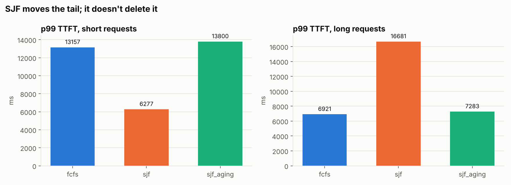

# inference-benchmark

[](https://github.com/sparkling-snail/inference_benchmark/actions/workflows/ci.yml)

**Benchmarked inference recipes for open LLMs, measured as SLO goodput and
cost per token, plus a continuous-batching engine built from scratch to
understand what the serving runtimes do internally.**

| | What it is | Where |
|---|---|---|
| **Inference recipes** | Model × engine × precision × parallelism matrix. Each deployment gets launched, load-tested until it breaks its SLO, and written out as a recipe: how to run it, the envelope it delivers, what it costs, and what a scheduler needs to place it. | [`benchmarks/`](benchmarks/), [`configs/`](configs/), [`recipes/`](recipes/) |
| **Serving engine** | Static batching → KV cache → batched KV cache with mid-batch admit/evict → continuous-batching scheduler with pluggable admission policies, each verified token-for-token against Hugging Face. Served over the same OpenAI-compatible API as vLLM. | [`engine/`](engine/) |
| **Tail-latency study** | Four experiments that each isolate one source of p99: queueing, prefill/decode interference, KV-cache preemption, head-of-line blocking. | [`experiments/tail/`](experiments/tail/) |

## First results: 8× A100 40GB, vLLM, Qwen2.5 7B and 72B

A one-hour run of six deployments, each measured as goodput at p99 TTFT ≤ 1 s
and p99 inter-token latency (ITL) ≤ 100 ms. Full write-up:
**[docs/findings-a100x8.md](docs/findings-a100x8.md)**. Recipe table:
[recipes/](recipes/README.md).

- **The inter-token latency tail sets the limit.** p99 ITL ran 5–7× the median
  and capped goodput in 5 of 6 deployments, while TTFT had room. For 72B, the
  100 ms ITL target cut usable throughput about 4× compared with a 140 ms one,
  more than any configuration change did.
- **7B: TP 2 beat TP 1 per GPU** (2.4× the goodput on 2× the GPUs). Faster
  decode steps plus 2.7× the KV cache outweighed the all-reduce cost.
- **Weight-only FP8 on A100 bought memory, not efficiency.** Median ITL improved
  ~40% on 7B, but the tail got worse and goodput per GPU fell 22–29%. 72B fit
  on 4 GPUs instead of 8, at lower output per GPU.
- **250 GSM8K examples can't resolve a 2-point quality bar.** Three BF16 runs
  of the same weights spread over 3.6 points, so both FP8 verdicts are reported
  as inconclusive. This also exposed a baseline-selection bug in the gate, since
  fixed.

---

## Inference recipes

### The question

For a given model and latency SLO, which **engine, precision and GPU layout**
serves it at the lowest cost per token, without an unacceptable drop in quality?

Peak throughput doesn't answer that, because it's measured while the queue is
overflowing and p99 is already blown. This project measures **SLO goodput**: the
highest arrival rate a deployment sustains while p99 TTFT, p99 inter-token latency
and error rate all stay inside the SLO. Cost is then priced at that rate.

### The matrix ([`configs/l4x4.yaml`](configs/l4x4.yaml))

One 4× NVIDIA L4 box (AWS `g6.12xlarge`). L4 is an Ada GPU, so FP8 runs on native
FP8 tensor cores, and the four GPUs share PCIe with no NVLink, which the TP rows
are partly measuring.

| Model | Why it's in the matrix | Configs |
|---|---|---|
| Llama-3.1-8B-Instruct | Fits one GPU, so TP is purely a latency/cost trade | vLLM, SGLang × BF16, FP8 × TP 1/2/4; n-gram speculative decoding |
| Qwen2.5-14B-Instruct | ~28 GB of BF16 weights don't fit one 24 GB L4: **BF16 on 2 GPUs vs FP8 on 1?** | BF16 TP 2/4, FP8 TP 1/2, PP=2 vs TP=2 |
| Qwen3-30B-A3B (MoE) | 30B total / 3B active parameters | FP8 × TP 2/4 × expert parallel on/off |

**SLO (interactive chat):** p99 TTFT ≤ 1 s, p99 ITL ≤ 100 ms, errors ≤ 1%.
**Workload:** ~250–1,300 prompt tokens, 64–256 output tokens, Poisson arrivals.

> **Status:** the pipeline, including the accuracy gate, runs end to end in CI
> against a simulated engine ([`tests/fake_vllm_server.py`](tests/fake_vllm_server.py)).
> The first GPU run used a one-hour cut of the matrix on 8× A100 instead of this
> L4 box; see [First results](#first-results-8-a100-40gb-vllm-qwen25-7b-and-72b).
> The full L4 matrix hasn't been run yet.

### How a deployment is measured

```
matrix YAML ──► launch server ──► warm up ──► goodput search ──► recipe YAML ──► recipe table
               (vLLM / SGLang /    (never      (open-loop Poisson     (+ raw per-probe
                engine / external)  measured)   probes, double then    JSON in results/)
                                                bisect to the SLO edge)
```

- **Open-loop load.** Requests are sent on a Poisson schedule regardless of how
  fast the server answers. A closed-loop benchmark (N clients that wait for a
  reply) slows its own arrivals when the server slows down, which hides the
  queueing tail.
- **Per-chunk timestamps.** ITL is measured between streamed chunks, not averaged
  per request, so a single 2-second stall can't hide inside a mean.
- **Goodput search.** The arrival rate is doubled until a probe breaks the SLO,
  then bisected (geometric midpoint) to within 10%. Every probe is kept, so you
  can see where the edge is and why it failed (`ttft_p99`, `itl_p99` or `errors`).
- **Cost at the SLO.** `$/GPU-hour × GPUs ÷ output tokens per hour` at the
  goodput rate, not at peak.
- **Provenance.** Every recipe records the git commit, engine version, CUDA
  version, GPUs, `nvidia-smi topo -m` and the exact server command.

### What a recipe looks like

```yaml
name: qwen2.5-14b-instruct__vllm-fp8-tp1
model:     {id: Qwen/Qwen2.5-14B-Instruct}
runtime:   {engine: vllm, engine_version: …, cuda: …, command: [vllm, serve, …]}
precision: fp8
topology:  {gpu: NVIDIA-L4, gpus: 1, tp: 1, pp: 1, ep: false, interconnect: pcie}
slo:       {ttft_p99_ms: 1000, itl_p99_ms: 100, max_error_rate: 0.01}
envelope:                                    # at the SLO, not at peak
  goodput_rps: …
  output_tokens_per_s_per_gpu: …
  ttft_ms: {p50: …, p99: …}
  itl_ms:  {p50: …, p99: …}
  usd_per_1m_output_tokens: …
quality:                                     # accuracy gate, vs the most similar BF16 recipe
  status: pass                               # pass | fail | inconclusive
  baseline: qwen2.5-14b-instruct__vllm-bf16-tp2
  tasks: {gsm8k: {score: …, stderr: …}, mmlu: {score: …, stderr: …}}
  drop_pts: {gsm8k: …, mmlu: …}
k8s_profile:                                 # what a scheduler needs to place it
  resources: {limits: {nvidia.com/gpu: 1}}
  nodeSelector: {nvidia.com/gpu.product: NVIDIA-L4}
provenance: {git_commit: …, measured_at: …, gpus_seen: […]}
```

### Accuracy gate

A cheaper recipe only counts if it's still good enough. After each deployment's
goodput search, [`lm-evaluation-harness`](https://github.com/EleutherAI/lm-evaluation-harness)
(GSM8K and MMLU) runs against the same live server, and the scores go into the
recipe. Once every deployment has scores, each non-BF16 recipe is compared with the
most similar BF16 recipe of the same model (same engine, same TP, no speculative
decoding). It **fails if any task drops by more than `max_drop_pts`**, passes if
every task stays clearly within it, and is **inconclusive** when the ±2
standard-error interval around the drop straddles the threshold. Failing recipes
are listed separately under the table and don't appear in the ranking.

- Only deployments that meet the SLO are scored. Scores are cached per
  (model, engine, precision, speculative decoding) within a run, because tensor
  parallelism shouldn't change them beyond noise.
- The gate is a separate pass from measuring, so changing the threshold doesn't
  need another GPU session: `python -m benchmarks gate --max-drop-pts 0.5`.
- The statistics are reported, not hidden: the table shows each drop with its
  ±2-standard-error interval. GSM8K's standard error is ~1.1 points even on the
  full set, which is why the study uses a 2-point bar rather than 1.
- The baseline is never "the best-scoring BF16 run". With several noisy BF16
  scores, picking the maximum biases every comparison towards failing; the first
  A100 run caught exactly that.
- CI exercises the whole path (launch → search → score → gate → report) with a
  stub in `tests/stubs/lm_eval` that returns fixed scores; the real harness is
  only used on the GPU box.

### Run it

```bash
pip install -r requirements.txt

# anywhere, no GPU: the whole pipeline against a simulated engine (~2 min)
python -m benchmarks run configs/smoke.yaml

# on the GPU box
pip install vllm sglang "lm-eval[api]"
python -m benchmarks plan configs/l4x4.yaml                  # the 30 deployments + server commands
python -m benchmarks run  configs/l4x4.yaml --skip-existing  # resumable; one failure doesn't stop the rest
python -m benchmarks run  configs/l4x4.yaml --only 14b fp8   # a subset
python -m benchmarks gate --max-drop-pts 2.0                 # re-apply the accuracy gate to stored scores
python -m benchmarks report                                  # rebuild recipes/README.md
```

Scoring needs `pip install "lm-eval[api]"` on the GPU box; leave out the `quality:` block
in the matrix to skip it.

To benchmark a server you started yourself, use `engine: external` with a
`base_url` in the matrix.

---

## The engine: continuous batching from scratch

Built on a small Hugging Face model (GPT-2) so the scheduling and cache
decisions are the only moving parts. The transformer itself isn't
reimplemented.

| Layer | What it adds | Verified by |
|---|---|---|
| [`scheduler_naive.py`](engine/scheduler_naive.py) | Static batching, full recompute every step. The "before" number. | [`bench_static.py`](engine/bench_static.py) |
| [`kv_cache_single.py`](engine/kv_cache_single.py) | KV cache for one sequence: after prefill, only the newest token goes through the model | token-for-token match with HF `generate(use_cache=True)` |
| [`kv_cache_batched.py`](engine/kv_cache_batched.py) | Per-sequence cache rows with mid-batch **evict** and **admit**, including both left-padding directions | every request matches its standalone run |
| [`scheduler.py`](engine/scheduler.py) | Continuous batching: a freed slot is refilled the step it frees up. Pluggable admission: `fcfs`, `sjf`, `sjf_aging` | output is independent of policy and batch-mates; mid-run admits observed |
| [`server.py`](engine/server.py) | OpenAI-compatible streaming API, so the engine is benchmarked over HTTP like vLLM | — |

The correctness bar is exact token match, not "looks right". A cache bug such as
misaligned position IDs for a left-padded row produces plausible but wrong text,
and it only shows up once requests are admitted and evicted mid-batch. The
`"Hi"` prompt in the batched-cache check is a regression test for exactly that bug.

```bash
python -m engine.verify.kv_cache_single
python -m engine.verify.kv_cache_batched
python -m engine.verify.scheduler
python -m engine.bench_static
python -m engine.server --runtime continuous --port 8000   # then point the pipeline at it:
python -m benchmarks run configs/engine_local.yaml          # static vs continuous, same SLO search
```

---

## Where p99 comes from

[`experiments/tail/`](experiments/tail/) isolates one tail-latency mechanism per
experiment. Experiments 1–3 run against vLLM on a GPU. Experiment 4 runs against
this repo's engine, comparing admission policies on the same Poisson trace:

<picture>
  <source media="(prefers-color-scheme: dark)" srcset="results/tail/figs-dark/exp4_hol_blocking.png">
  
</picture>

Shortest-job-first halves short requests' p99 TTFT (13.2 s → 6.3 s) and makes
long requests' p99 about 2.4× worse (6.9 s → 16.7 s). It moves the tail rather
than removing it. Aging bounds the damage to long requests, but at this
threshold it gives back almost all of SJF's gain for short ones.

---

## Repo layout

```
benchmarks/          recipe pipeline
  matrix.py            matrix YAML -> deployments (cartesian product, drops what doesn't fit)
  launcher.py          deployment -> vLLM / SGLang / engine command, health wait, environment capture
  loadgen.py           open-loop streaming load generator, per-chunk timestamps, /metrics scrape
  goodput.py           SLO check + double-then-bisect goodput search
  recipe.py            envelope, cost, k8s placement profile, provenance
  report.py            recipe table
configs/             l4x4.yaml (the study), smoke.yaml (CI), engine_local.yaml
recipes/             generated recipe YAMLs + table
engine/              from-scratch serving engine + OpenAI-compatible server
  verify/              exact-match correctness checks
experiments/tail/    tail-latency experiments
results/             raw data, every file stamped with git commit and config
tests/               unit tests + fake vLLM-shaped server
```

## Roadmap

1. **GPU pilot.** The Llama-8B vLLM rows on a single-L4 `g6.xlarge`
   (`--only llama vllm`), to catch engine-flag drift, model-access and
   out-of-memory problems cheaply before renting four GPUs.
2. **Full study.** All 30 deployments in [`configs/l4x4.yaml`](configs/l4x4.yaml)
   on a `g6.12xlarge` (~12–15 GPU-hours), plus tail-latency experiments 1–3 in
   the same session.
3. **Write-up.** The recipe table and the main findings at the top of this
   README, for example whether a 14B model is cheaper as FP8 on 1 GPU or BF16
   on 2, plus a short blog post.
4. **Afterwards:**
   - **Release qualification.** A `qualify` command that re-runs a recipe after
     an engine, driver or model bump and fails if it falls outside its stored
     envelope.
   - **Recipe API for agents.** An MCP server over `recipes/`, answering
     questions like "cheapest config for model X at p99 TTFT < 500 ms".
   - **TensorRT-LLM** for the 8B model, and an Nsight Systems trace of prefill
     vs decode kernels.

## Limitations

- Single node: TP, PP and EP are all within one PCIe-connected box. NVLink,
  multi-node and RDMA effects are out of scope.
- Synthetic prompts (seeded, no shared prefixes), so prefix caching isn't
  exercised; that belongs in a separate workload.
- FP8 is the engines' dynamic per-tensor quantization, without calibration.
